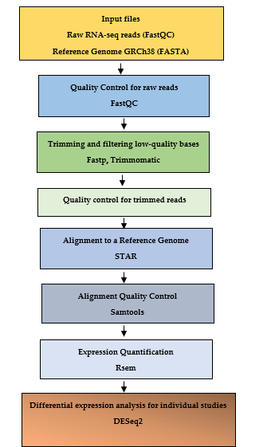

# RNA-seq-Data-Analysis

This repository provides a complete RNA-Seq data analysis pipeline using the DESeq2 package, covering all essential steps of the process. It includes gene expression quantification and data normalization to correct for technical variations. Differential gene expression (DEG) analysis is performed to identify genes that are differential expressed between experimental conditions, with results visualized through PCA and volcano plots. Finally, additional visualizations are generated to explore changes in gene expression and functional analyses, such as biological pathway enrichment, providing a comprehensive interpretation of the RNA-Seq data.

The data used in this analysis comes from a publicly available experiment in the NCBI BioProject database under the accession

(GEO: **GSE54456**).

> **Title**: Transcriptome analysis of psoriasis in a large case-control sample: RNA-seq provides insights into disease mechanisms
>
> **Instrument: Illumina Genome AnalyzerData**
>
> **Strategy**: RNA-Seq
>
> **Source**: TRANSCRIPTOMIC
>
> **Selection**: cDNA
>
> **Layout**: SINGLE
>
> **Construction Protocol**: RNA was prepared from the frozen biopsies using the Qiagen Allprep kit. Skin punch biopsies were trimmed of visible subcutaneous fat and visible blood was removed by blotting on saline-soaked gauze. Biopsies were then snap frozen in liquid nitrogen and stored at -80 deg C. For RNA isolation, frozen skin biopsy samples were wrapped in an aluminum foil pouch pre-frozen in liquid nitrogen, placed in a prechilled steel mortar, and crushed with a hammer. The pulverized frozen tissue was quickly transferred into a 1.5-ml microcentrifuge containing 1 ml of the Allprep buffer and glass grinding beads. The tube was vigorously agitated on a Vortex mixer for 5 minutes to complete the extraction process. From this point on the sample was processed exactly as described in the kit manual. RNA quality and quantity were checked using an Agilent Bioanalyzer. Libraries for high throughput sequencing were prepared using the Illumina mRNA-Seq kit. Briefly, the process involved isolating polyadenylated RNA, fragmentation by heating at 90°C, random-primed cDNA preparation, ligation of adaptors, and size selection on an agarose gel. A gel slice corresponding to approximately 120 bp insert was isolated, and the DNA was extracted and amplified by 15 cycles of PCR using the adaptor primers. The gel purified final product was checked for quality and quantity on an Agilent Bioanalyzer. The library thus prepared was sequenced one sample per lane in an 8-lane flow cell on the Illumina Genome Analyzer IIx. The raw sequencing output of the 80-base single read sequencing was 2000-3000 Mb per lane corresponding to 25-37.5 million reads.

The raw FASTQ files from **skin biopsy samples** of both patients with hidradenitis suppurativa and controls were downloaded, along with their associated metadata, and processed up to quantification using the bash pipeline available in the image.

# Resources

-   [Transcriptome analysis of psoriasis in a large case-control sample: RNA-seq provides insights into disease mechanisms](https://www.ncbi.nlm.nih.gov/bioproject/?term=PRJNA236547%20)

-   [RNA-seq: Basic Bioinformatics Analysis](https://pubmed.ncbi.nlm.nih.gov/30222249/)

-   [RNA-Seq Experiment and Data Analysis](https://pubmed.ncbi.nlm.nih.gov/35119677/)

-   [RNA-seq Data Analysis for Differential Expression](https://pubmed.ncbi.nlm.nih.gov/34686975/)

-   [Biomedical Knowledge Mining using GOSemSim and clusterProfiler](https://yulab-smu.top/biomedical-knowledge-mining-book/index.html)

-   [Introduction to differential gene expression analysis](https://hbctraining.github.io/DGE_workshop/lessons/01_DGE_setup_and_overview.html#rna-seq-count-distribution "Introduction to differential gene expression analysis")

-   [RNA-seq workflow: gene-level exploratory analysis and differential expression](https://master.bioconductor.org/packages/release/workflows/vignettes/rnaseqGene/inst/doc/rnaseqGene.html#running-the-differential-expression-pipeline)

-   [Introduction to RNA-Seq using high-performance computin](https://hbctraining.github.io/Intro-to-rnaseq-hpc-O2/lessons/03_alignment.html)
